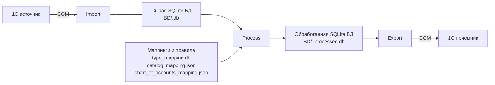
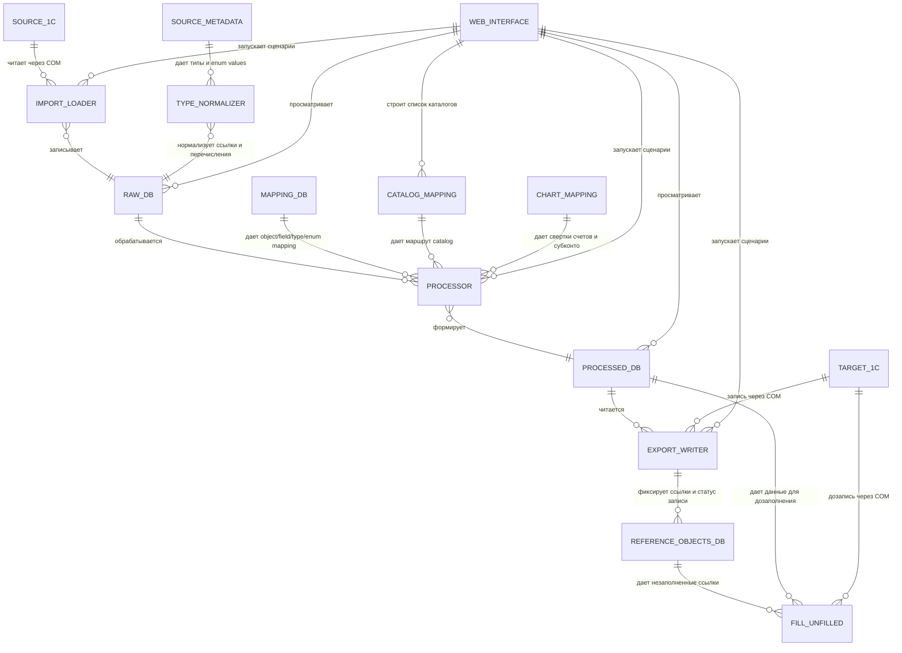

# 1C SQLite Bridge

Система миграции данных между базами 1С через промежуточный слой SQLite и Python.

Текущий основной сценарий репозитория: перенос данных из `УПП` в `УХ`. Архитектура разбита на три стадии:

- `import`: чтение данных из 1С источника и сохранение в SQLite;
- `process`: преобразование структуры, типов, ссылок и значений под приемник;
- `export`: запись обработанных данных в 1С приемник через COM.



Более детально по модулям и артефактам:



Корневой `README` оставлен кратким. Подробная документация по рабочим блокам лежит в [`docs/`](docs/).

## Документация

- [Онбординг и обновление метаданных](docs/onboarding.md)
- [Импорт из 1С в SQLite](docs/import.md)
- [Обработка данных](docs/processing.md)
- [Экспорт в 1С](docs/export.md)
- [Маппинг объектов, полей, типов и перечислений](docs/mapping.md)
- [SQLite-базы и reference objects](docs/database.md)
- [Веб-интерфейс](docs/web-interface.md)

## Структура проекта

- `IN/` - загрузчики из 1С в SQLite
- `PROCESS/` - преобразование сырых БД в обработанные
- `OUT/` - выгрузка из SQLite в 1С
- `CONF/` - метаданные, JSON-маппинги и `type_mapping.db`
- `BD/` - рабочие SQLite-базы
- `tools/` - общий слой COM, SQLite, маппинга, логирования и служебных операций
- `templates/` - HTML-шаблоны веб-интерфейса

## Преимущества Подхода

По сравнению со стандартной конвертацией этот подход дает более высокий уровень управляемости и сопровождения.

- Управляемость и контроль. Данные проходят через SQLite-слой, а ссылочные объекты и связи по УИД сохраняются отдельно. Это дает возможность понимать, что уже записано, что не дозаполнено, что и когда можно повторно выгрузить, удалить или перезаписать без работы вслепую.
- Прозрачная промежуточная база. Есть сырые и обработанные БД, которые можно просматривать, проверять и сравнивать до записи в приемник.
- Гибкая обработка данных. Между импортом и экспортом есть отдельный этап подготовки данных с маппингами, свертками, заменой типов, преобразованием перечислений, настройкой ссылок и прикладной логикой под конкретную конфигурацию.
- Веб-интерфейс. Операционные сценарии можно запускать и контролировать не только из CLI, но и через браузер, включая просмотр БД и логов.
- Работа по расписанию. Сценарии можно запускать автоматически, в том числе через `scheduled_import.py` и внешний планировщик.
- Уведомления после выполнения. После завершения процесса можно отправлять уведомления в мессенджер, чтобы не отслеживать запуск вручную.
- Точечная догрузка и повторный запуск. Можно экспортировать не только полный каталог, но и отдельные записи, а также дозаполнять незаполненные ссылочные объекты отдельным проходом.
- Быстрая адаптация новых сущностей. За счет модульной схемы `IN / PROCESS / OUT` новые объекты можно подключать поэтапно, а при использовании AI-заряженных IDE быстрее собирать новые loader/processor/writer и уточнять маппинги под новый кейс.
- Лучше подходит для итеративной миграции. Можно сначала быстро выгрузить и проверить ограниченный набор сущностей, затем доработать маппинги и только после этого масштабировать сценарий.

## Быстрый старт

1. Скопировать `.env.example` в `.env` и заполнить строки подключения.
2. Подготовить или обновить метаданные источника и приемника по инструкции из [docs/onboarding.md](docs/onboarding.md).
3. Выполнить импорт, обработку и экспорт нужного каталога через `main.py`.

Пример:

```bash
python main.py --import --catalog contractors --source-1c source --sqlite-db BD
python main.py --process --catalog contractors --sqlite-db BD
python main.py --export --catalog contractors --target-1c target --sqlite-db BD
```

## Требования

- Windows
- Python 3.10+
- установленная платформа 1С
- доступ к COM (`pywin32`)

Установка зависимостей:

```bash
pip install -r requirements.txt
```


Проект миграции под ключ можно заказать у наших партнеров, [ООО «Рациональ»](https://rational-it.ru/perehod-s-1c-upp-na-1c-erp/).

## License

MIT. See `LICENSE`.
